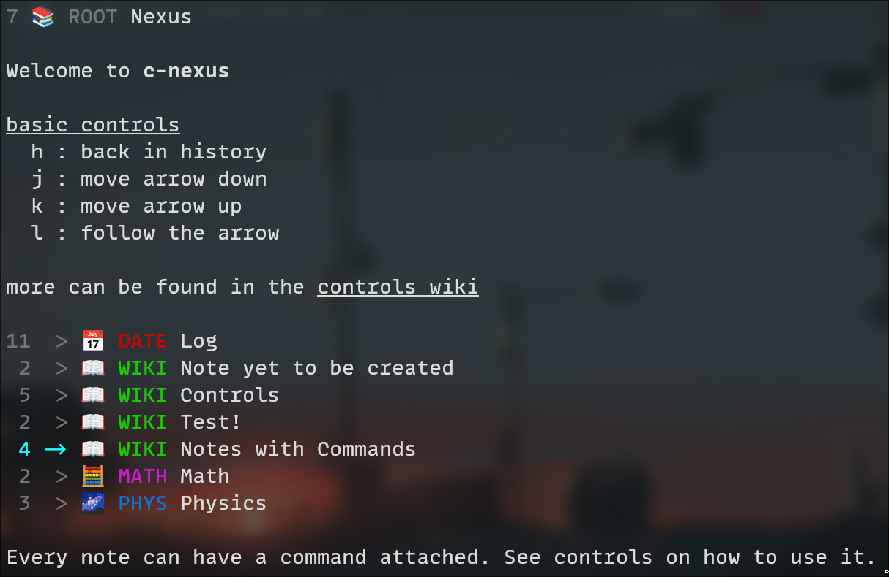

# c-nexus

| normal                     | search                       | icon                     |
| ---                        | ---                          | ---                      |
|  |  |  |

Small code footprint.

Create notes and link them, however you can think of. Once created you can browse the nodes.

It's possible to link a note to one that may or may not get created in the future.

## Installation

```sh
git clone https://github.com/rphii/c-nexus
cd c-nexus
make
```

or alternatively *without* `make` (you can choose your compiler of choice; gcc, clang, tcc, ...)

```sh
git clone https://github.com/rphii/c-nexus
cd c-nexus
gcc src/*.c -o a
```

In both cases it creates an executable `a`; adjust it if desired.

### Compile Flags

- `-DCOLORPRINT_DISABLE` disable all colored/bold/italic (formatted) output
- `-DPROC_COUNT=<num>` number of threads
- `-DNODE_SHOW_COUNT_IN_OUT=1` show in and outgoing number of notes, instead of the sum
- `-DVECTOR_SORT_DATES_FIRST=1` show dates first, then icons

### Clean

- run `make clean`
- on Cygwin trick it into thinking we're on linux so it can use rm etc. by running `OS= make clean`
- on Windows I don't know if this cleaning stuff works (or anything in general... if something
  doesn't quite work on windows, well, I'll fix it maybe, if I know about the issue and feel like
  fixing it)

## Views

These controls (and maybe even more) are also found in the nexus itself, since I keep that more
updated than this readme... Gotta use your program, y'know :)

### Normal View
- ``h`` : go back in history (can be: viewed notes, searches)
- ``j`` : down
- ``k`` : up
- ``l`` : follow the arrow
- ``q`` : quit
- ``Q`` : rebuild (certainly works on linux)
- ``[space]`` : fold/unfold descriptions
- ``f`` : enter search view
- ``t`` : enter icon view

### Search View
- ``[type something]`` : search for something, case insensitive
- ``[enter]`` : switch from editing search string to selecting found nodes; in this mode ..
    - .. `hjkl` : behaves as it would in normal view
    - .. `f`, `[enter]` : puts you back to editing the search string
    - .. `F` : clears the editing string and puts you back to editing it
    - .. `[escape]` : goes back to node you've watched before searching; as if nothing was
      selected (it goes back in the history)
    - .. ``t`` : enter icon view
    - .. ``q`` : quit
    - .. ``Q`` : rebuild (certainly works on linux)

### Icon View
- `hjkl` : behaves as it would in normal view
- ``t``, `[escape]` : abort icon view and go back
- ``f`` : enter search view
- ``q`` : quit
- ``Q`` : rebuild (certainly works on linux)

## Command Line Arguments

- Print version and exit : `--version`
- Change default view : `--view`
- Change entry note : `--entry`
- Print help (about these and more arguments) and exit : `--help`

## How to add notes?

Edit the [source file](src/content.c).

There's a handy macro called `NEXUS_INSERT`. See the example(s) provided.

### Upsides?
- at startup, all notes are stored in RAM (fast lookup)
- compile checked code/notes! _isn't that cool?_
- you can just disable the notes you don't want to be seen via. code!
- advanced formatting is [quite easily doable](src/colorprint.h); bold, italicize, underline and even colorize your texts!
- every note can have a icon + description (unlike in a file/folder structure, where folders typically don't)

### Downsides?
- at startup, all notes are stored in RAM (amount limited through RAM)
- no editing of notes while browsing them _(at least not yet)_
- terminal interface doesn't yet handle the displaying of very long notes

### Tradeoffs

One could argue that this approach is bad; well, it certainly
_isn't bad_ - I could've used (and probably will in the future) a file/folder structure with
HTML/Markdown files and just parse them instead. Since that also costs time to do, I for the time being,
focus on just getting the app working. Once that's all done and good and the project is at a point
where I'm satisfied with all the other, more important tasks that are screaming to get fixed, I'll
probably look into that a bit more.

During development of this project I came across several tradeoffs that I'm quite willingly going to
accept, for better or worse - but mainly for simplicity's sake in note organization.

- only one note with the same title is possible - and that is case insensitive at that
- each note can "only" have one command attached
- each note can only have one icon

## Notes on Searching
- if you have many notes, you might benefit from parallelized searching. you can activate it via
  specifing the number of threads with the preprocessor token `PROC_COUNT` (e.g. if you want to
  search with 8 threads, in the Makefile add `-DPROC_COUNT=8` to the `CFLAGS`)
- if multithreaded searching is enabled, I at the moment do not bother to sort the found results, so
  that's that (equal searches of something might spit them out in randomized order)
- even if you're not searching with multithreading, the results can seem unordered, because we're
  searching through the items in a hash table, after all. and I do not bother to sort them as well
- Q: why not sort the results?
    - A: 1) I don't know what to sort for, except maybe how likely a string is present...
    - A: 2) ...which I don't quite know how to do. I'd have to rework the searching algorithm...
    - A: 3) ...so when it bothers me too much, I'll rework it, eventually, maybe

